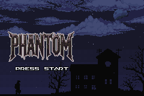

# Pokémon Phantom

Una isla remota te llama con promesas de nuevo comienzo.
Los habitantes sonríen, pero sus ojos miden tu utilidad.
Los Pokémon tiemblan en las sombras, recordando el sabor del metal.
En Sombraluna, la supervivencia tiene un precio que solo descubres cuando ya es demasiado tarde.

         

## Licencia

Este proyecto está licenciado bajo CC BY-SA 4.0, ya que incluye activos de Classic Shmups por David Teixeira.

Ver [LICENSE](LICENSE) para más detalles.

## Créditos

Ver [CREDITS.md](CREDITS.md) para más detalles.

## Recursos

- Para configurar el repositorio, ver [INSTALL.md](INSTALL.md).
- Para contactos y otros proyectos pret, ver [pret.github.io](https://pret.github.io/).

## ROM (referencia)

Construye la siguiente ROM:
- [**pokeemerald.gba**](https://datomatic.no-intro.org/index.php?page=show_record&s=23&n=1961) `sha1: f3ae088181bf583e55daf962a92bb46f4f1d07b7`
